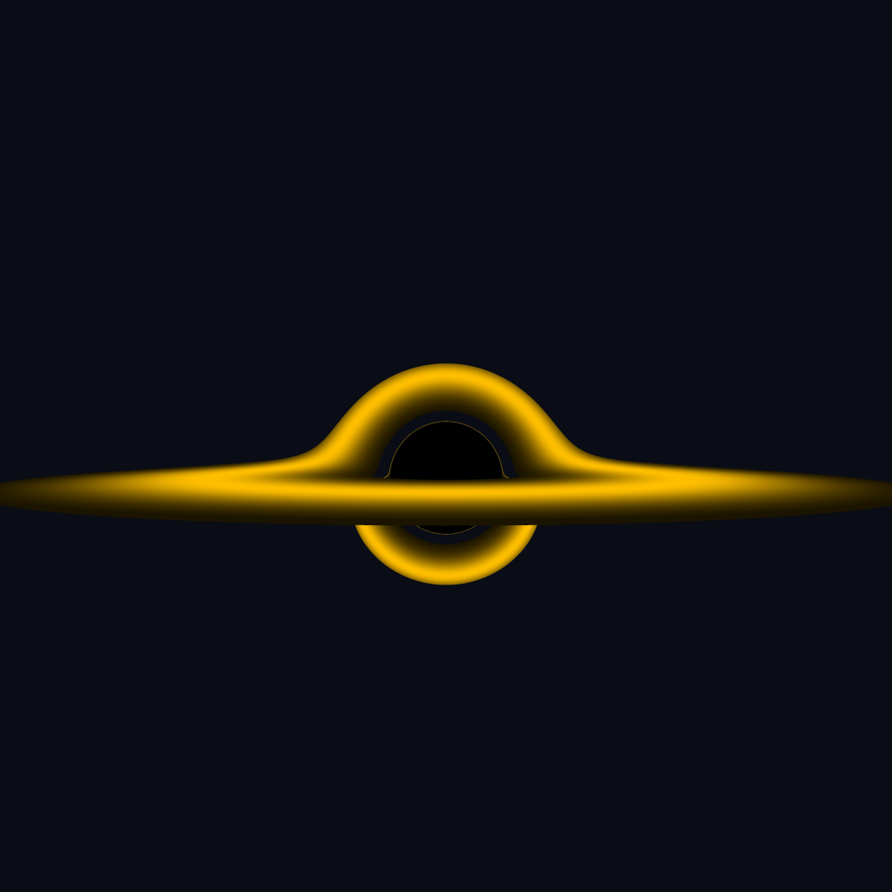

# BlackHoleRender

CompSci Masters Semester One coursework, extending an existing project to render a black hole.

## Briefing

This project covers an implementation of a parallel-distributed version of the existing Black Hole Rendering program.



## Requirements

The project was developed on Linux and Windows machines. 
All **cuda** branches utilising GPU, Windows environment, and Visual Studio 2022.
All the other branches mainly support Linux, therefore g++, gcc 
Windows: Visual Studio 2022 and support for Cuda Runtime v12.

### Windows

The cuda flavours require a dedicated GPU, and are developed in Visual Studio 2022, latter doesnt limit its compiling capabilities (still can be run from command line)

#### Command line

```
C:\Users\hornyakj\source\repos\CudaExercises>"C:\Program Files\NVIDIA GPU Computing Toolkit\CUDA\v12.6\bin\nvcc.exe" -gencode=arch=compute_52,code=\"sm_52,compute_52\" --use-local-env -ccbin "C:\Program Files\Microsoft Visual Studio\2022\Professional\VC\Tools\MSVC\14.41.34120\bin\HostX64\x64" -x cu   -I"C:\Program Files\NVIDIA GPU Computing Toolkit\CUDA\v12.6\include"  -G   --keep-dir CudaExercises\x64\Debug  -maxrregcount=0   --machine 64 --compile -cudart static  -g  -DWIN32 -DWIN64 -D_DEBUG -D_CONSOLE -D_MBCS -Xcompiler "/EHsc /W3 /nologo /Od /FS /Zi /RTC1 /MDd " -Xcompiler "/FdCudaExercises\x64\Debug\vc143.pdb" -o C:\Users\hornyakj\source\repos\CudaExercises\CudaExercises\x64\Debug\kernel.cu.obj "C:\Users\hornyakj\source\repos\CudaExercises\kernel.cu"
```

```
C:\Program Files\NVIDIA GPU Computing Toolkit\CUDA\v12.6\bin\nvcc.exe
-gencode=arch=compute_52,code=\"sm_52,compute_52\"
--use-local-env
-ccbin "C:\Program Files\Microsoft Visual Studio\2022\Professional\VC\Tools\MSVC\14.41.34120\bin\HostX64\x64"
-x cu
-I"C:\Program Files\NVIDIA GPU Computing Toolkit\CUDA\v12.6\include"
-G
--keep-dir CudaExercises\x64\Debug
-maxrregcount=0
--machine 64
--compile
-cudart static
```

#### Profiling

For profiling, Nvidia Nsight Compute 2024.3.2.0 was used.

### Linux (Ubuntu >=22)

On Linux, **g++** is suitable for compiling the *omp* and *serial* codes.

`g++ -O3 Functions.cpp main.cpp -o Executable -lpng -fopenmp`

> You will need libpng library installed
> g++ version >=10.x


`lscpu | grep 'Thread\|CPU(s):' | head -n 2`

For the Cuda flavour, you will need **nvcc** to compile the executable. 

Download the NVIDIA CUDA Toolkit

`nvcc` and add the flags from the [Windows instructions](#command-line)

## Reference

The default program originites from Aula Portal, under the module page.

Papers:

https://oseiskar.github.io/black-hole/docs/physics.html

## Contributors

J. Gergely Hornyak
